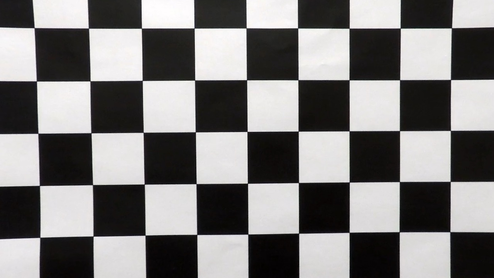
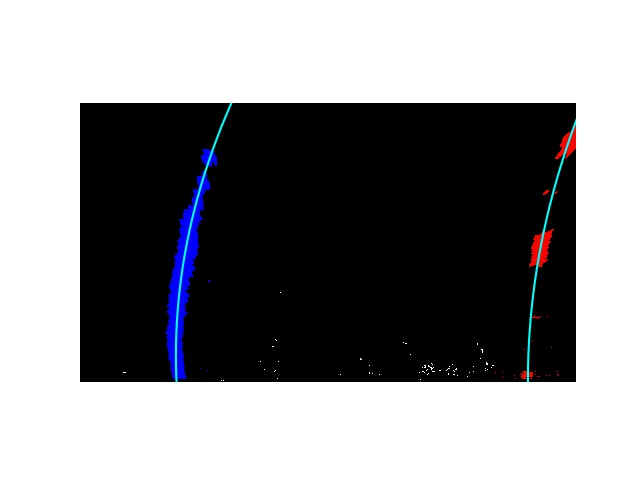

**Advanced Lane Finding Project**

The goals / steps of this project are the following:

* Compute the camera calibration matrix and distortion coefficients given a set of chessboard images.
* Apply a distortion correction to raw images.
* Use color transforms, gradients, etc., to create a thresholded binary image.
* Apply a perspective transform to rectify binary image ("birds-eye view").
* Detect lane pixels and fit to find the lane boundary.
* Determine the curvature of the lane and vehicle position with respect to center.
* Warp the detected lane boundaries back onto the original image.
* Output visual display of the lane boundaries and numerical estimation of lane curvature and vehicle position.

[//]: # (Image References)

[image1]: ./examples/undistort_output.png "Undistorted"
[image2]: ./test_images/test1.jpg "Road Transformed"
[image3]: ./examples/binary_combo_example.jpg "Binary Example"
[image4]: ./examples/warped_straight_lines.jpg "Warp Example"
[image5]: ./examples/color_fit_lines.jpg "Fit Visual"
[image6]: ./examples/example_output.jpg "Output"
[video1]: ./project_video.mp4 "Video"

## [Rubric](https://review.udacity.com/#!/rubrics/571/view) Points
###Here I will consider the rubric points individually and describe how I addressed each point in my implementation.  

---
###Writeup / README

####1. Provide a Writeup / README that includes all the rubric points and how you addressed each one.  You can submit your writeup as markdown or pdf.  [Here](https://github.com/udacity/CarND-Advanced-Lane-Lines/blob/master/writeup_template.md) is a template writeup for this project you can use as a guide and a starting point.  

You're reading it!
###Camera Calibration

####1. Briefly state how you computed the camera matrix and distortion coefficients. Provide an example of a distortion corrected calibration image.

The code for this step is contained in the first code cell of the IPython notebook located in "./src/calibrate.py".  

I start by preparing "object points", which will be the (x, y, z) coordinates of the chessboard corners in the world. Here I am assuming the chessboard is fixed on the (x, y) plane at z=0, such that the object points are the same for each calibration image.  Thus, `objp` is just a replicated array of coordinates, and `objpoints` will be appended with a copy of it every time I successfully detect all chessboard corners in a test image.  `imgpoints` will be appended with the (x, y) pixel position of each of the corners in the image plane with each successful chessboard detection.  

I then used the output `objpoints` and `imgpoints` to compute the camera calibration and distortion coefficients using the `cv2.calibrateCamera()` function.  I applied this distortion correction to the test image using the `cv2.undistort()` function and obtained this result: 

Before
 
After



###Pipeline (single images)
here we are processing on this test image:


####1. Provide an example of a distortion-corrected image.
To demonstrate this step, I will describe how I apply the distortion correction to one of the test images like this one:


####2. Describe how (and identify where in your code) you used color transforms, gradients or other methods to create a thresholded binary image.  Provide an example of a binary image result.
I used a combination of gradient x thresholds, gradient direction threshold and HLS S channel threshhold to generate a binary image (thresholding steps at `binary_thresh()` method in `./src/line_detect.py`).  The threshold of gradient x is from 20 to 100, the direction of gradient is between 0.7 to 1.3, and S channel value from 150 to 255.   Here's an example of my output for this step. 


####3. Describe how (and identify where in your code) you performed a perspective transform and provide an example of a transformed image.

The code for my perspective transform includes a function called `perspective_transform()`, which appears in the file `./src/line_detect.py`.  The `perspective_transform()` function takes as inputs an image (`img`), as well as source (`src`) and destination (`dst`) points.  I chose the hardcode the source and destination points in the following manner:

```
            src = np.array([
                [565, 470],
                [210, img_height],
                [1120, img_height],
                [715, 465]
            ], dtype=np.float32),
            dest = np.array([
                [210, 200],
                [210, img_height],
                [1120, img_height],
                [1120, 200]
            ], dtype=np.float32)

```
This resulted in the following source and destination points:

| Source        | Destination   | 
|:-------------:|:-------------:| 
| 565, 470      | 210, 200        | 
| 210, 720      | 210, 720      |
| 1120, 720     | 1120, 720      |
| 715, 465      | 1120, 200        |

I verified that my perspective transform was working as expected by drawing the `src` and `dst` points onto a test image and its warped counterpart to verify that the lines appear parallel in the warped image.


####4. Describe how (and identify where in your code) you identified lane-line pixels and fit their positions with a polynomial?

The code for my polynomial fitting includes two function called `slide_window_point_extract()` and `poly_fit()`, which appears in  in the file `./src/line_fit.py`. `slide_window_point_extract()` extracting the point in left and right lane with slide window histogram method,  then `poly_fit()` take these point and fit my lane lines with a 2nd order polynomial kinda like this:



But when in video, because for most frames, I can take the poly fit information from previous frame, so I take the following approch to smooth the detect line between frames also to compensate the noise(shadow, dirt) occur in few frames.

* For first frame, take slide window to search the line
* Next frame, only search in a margin around the previous line position
* Cuculate the diff of fit from last frame to this frame, if is too much, take a count, and keep the cached previous line position, otherwise, replace previous line position with new position. The diff is calculated by the average change of each parameter of polyfit.
* If for previous 5 frame, the diff is all higher than threshold, then drop the cached previous line position, and use slide window to search line again 

####5. Describe how (and identify where in your code) you calculated the radius of curvature of the lane and the position of the vehicle with respect to center.

To calcaulate the radius, I did this in my code with `compute_curvature_and_root_point()` method, in `./src/line_fit.py`, by caculating the curvature radias next to the car which y locate at the botom of the image, and also I magnifyed the point `poly_fit()` generated to the scale in meter by times a ratio between meter and pixels. The magnitude in x is dynamic update with the distance of the point of two line identified as 3.7m.

And to calculate the offset, I assume the camera is located at the middle of the car. So I get the coordinate in meter of both lane line in the bottom which closest to the car, then calculate the absolute offset of the middle of this two point to the middle of the image. The code is located at `compute_offset()` method in `src/line_fit.py`

####6. Provide an example image of your result plotted back down onto the road such that the lane area is identified clearly.

I implemented this step in my code in `./src/line_detect.py` in the function `final_draw()`.  Here is an example of my result on a test image:


---

###Pipeline (video)

####1. Provide a link to your final video output.  Your pipeline should perform reasonably well on the entire project video (wobbly lines are ok but no catastrophic failures that would cause the car to drive off the road!).

Here's a [link to my video result](./output_images/project_video.mp4)

---

###Discussion

####1. Briefly discuss any problems / issues you faced in your implementation of this project.  Where will your pipeline likely fail?  What could you do to make it more robust?

* the slide window and cache previous line position approch is assumed that the noise frame is only showing in few frames, but if the input video get a lot of shadows or flickers all the time, this approach will fail. So I think to make it more robust, I should fine tune the filters for the noise frames.
* Maybe noise reduction or dynamic contrast will help
* For Sharp turn, it's tend to fail because the lane line at the far end my exceed the view of perspective, and the pixel for slide window will not long enough. So future analyze perspective transform window is needed.
* For performance consideration, this approach is arouch 7 fps on my Mac, not a realtime solution which is required for real self-driving car use. So neural network solution like [Free-Space Detection with Self-Supervised and Online Trained
Fully Convolutional Networks](https://arxiv.org/pdf/1604.02316.pdf) may help for it can be GPU-accelerated, also more scalable and robust for different road.


